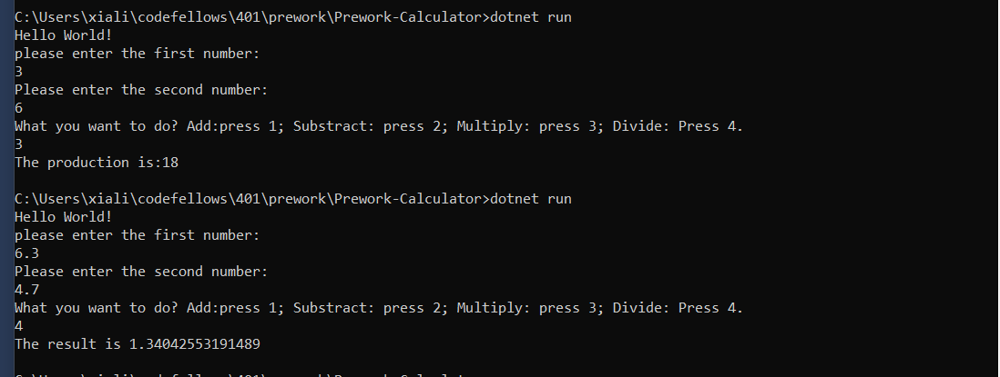

# Prework-Calculator
 1. Basic Calculator

 2.Do the operations based on two numbers user type

 3.4 different operations:Add, Subtract, Multiply,Divide.
 

 4.User can choose what operation he/she wants in main menu.
 